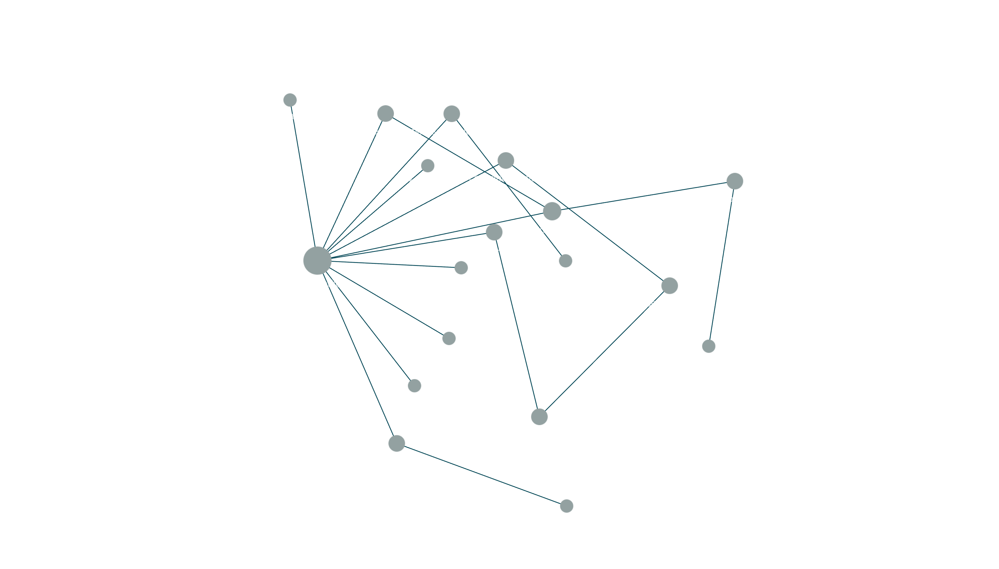
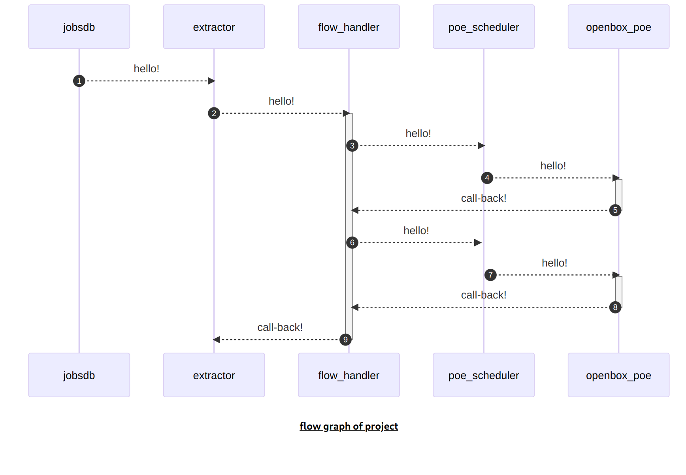
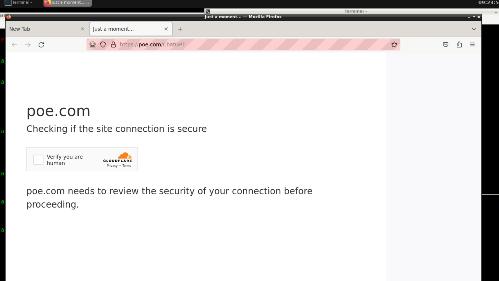
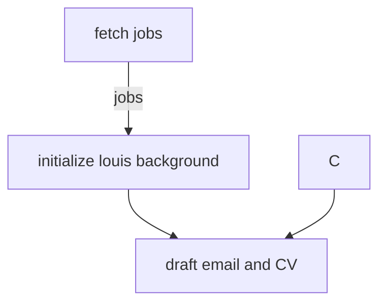

## overview




## to start running

```bash
$ npm run dc_prod
$ npm run dc_test

#inside test container
$ ./helloworld.sh

# wait for all containers online
# ? screen capture here ?

# browse http://localhost:55000 -> change detect

```

### TODO:

  - status dashboard ?
  - better telegram message
    - link directly


### redis

docker compose -f ./docker-compose.gen.yml \
  exec -it redis bash

redis-cli config set dir /data


https://hk.jobsdb.com/hk/en/job/quality-engineer-100003010347214
https://hk.jobsdb.com/hk/en/job/validation-assistant-100003010509868

https://hk.jobsdb.com/hk/search-jobs/validation


### considerations:
  - multithreaded
    - if using puppeteer + express solution, the scheduler possibility need to implement by myself aswell
    - use browserless to avoid implementing scheduler
    


### v2raya in the middle, i add the proxy function to puppeteer already. 
  - the remaining part should be integrate it into the main openbox-poe-seat program.


### reseed user profile for google chrome

```bash
# 1. at projectroot
$ cd _seeds
$ ./reseed.sh
# will open a chrome browser, go through tutorial

# stop openbox-poe-seat if running
$ docker compose kill openbox-poe-seat1


# /workspace/ai-playlist/poe-tryout/docker-poe-tryout/src/volumes/openbox-poe-seat1
$ ./renew_user_data_.sh

$ docker compose restart openbox-poe-seat1

```




### system design


### component introduction

### directory introduction

```bash
$ tree -L 3 -d -a
.
├── docs                          ( documentation )
├── _seeds                        ( seed for openbox-firefox )
│   └── chrome-user-data-seed                        
└── src                               
    ├── bait                      ( hosting self bait page )
    ├── changedetect              ( changedetect container home )
    ├── dbapi                     ( dbapi container home )
    ├── flow-handler              ( main entry point, workflow control )
    ├── jobsdb-link-extractor     ( jobsdb-link-extractor home )
    ├── openbox-seat              ( openbox-seat home )
    ├── poe-scheduler-api         ( poe-scheduler-api source/container home )
    ├── static-share              ( output hosting/container home )
    └── volumes                   ( docker persistance strage )
```

### tags
  - ai training ( poe / chatGPT / googlePalm)
  - api testing ( expressjs )
  - stealthing / automation / puppeteer
  - ui testing (google chrome / chromium / firefox )
  - stealthing
  - queueing / state machine
  - changedetect / browserless
  - jobsdb

### endpoints
  - poe-scheduler
    - /chatGPT/helloworld      ( poe chatGPT helloworld self-test )
    - /chatGPT/ask             ( ask poe/chatGPT )
    - /googlePalm/helloworld   ( poe/googlePalm helloworld self-test )
    - /googlePalm/ask          ( ask poe/googlePalm )

### steps to develop
```bash
# in project root
$ cp .env.example .env

# if not build openbox-poe-seat image
$ cd src/openbox-poe-seat
$ ./build_image.sh
$ ./push.sh
# openbox-poe-seat build done

$ npm run docker_dev 
```

  - start firefox, import mitm certificate
  - mitm is not used at the moment
  - test poe login state by start_firefox.sh
  - start ./test.sh at openbox-firefox container
  - to ensuore you are good to go
    - run `/workspace/ai-playlist/poe-tryout/docker-poe-tryout/src/openbox-firefox/src/tests/ChatGPT/ask_helloworld/test.sh` -> the simpleest helloworld question to poe chatgpt

### tackle cloudflare bot preventation 
  - so i change my path to using google-chrome


```bash
$ npm install puppeteer-extra puppeteer-extra-plugin-stealth
```

### build

```bash
$ build.sh

```


### useful links

[]

## Flow (planning)




### preprompt tryout

### test 1 (testing on chatGPT)
preprompt
start a fresh talk
remember you a person live in hong kong named louis

question
what is this person name ?


### google-palm tryout


### start

```bash
# build openbox-ubuntu image
$ ./build.sh
$ docker compose up -d

# mongo-express always cannot connect to mongo at start, manually restart
$ docker compose restart mongo-express
```

### to run script inside src directory


### high level design
  1. fetch (HLD)
  1. draft (HLD)
  1. review (HLD)
  1. send (HLD)


### References:
  - https://github.com/f/awesome-chatgpt-prompts
  - https://florianholzapfel.github.io/express-restify-mongoose


### logs
  - 2023-08-01: add expres database to store log
    - draft google-palm support
    - update pre-prompt


### TODO:
  - docker-compse.production.yml