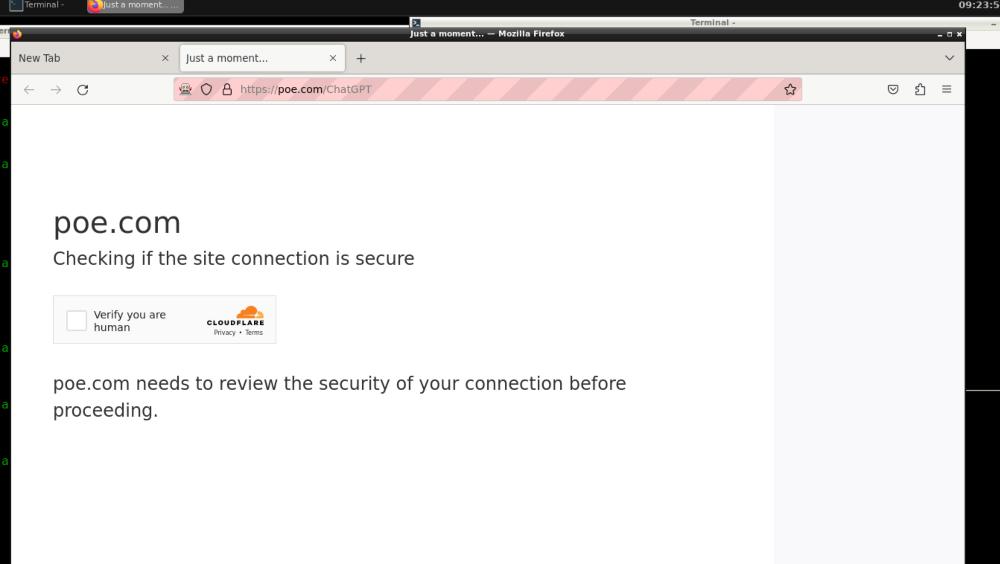
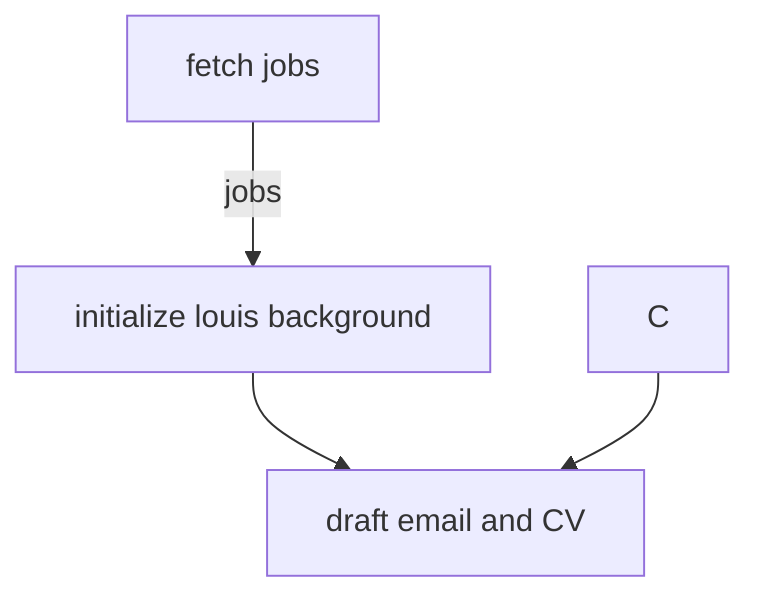

## draft

### tags
  - ui testing
  - api testing
  - ai training
  - browser stealthing

### endpoints
  - kue-scheduler
    - /chatGPT/helloworld
    - /chatGPT/ask
    - /googlePalm/helloworld
    - /googlePalm/ask

### steps to develop
  - start firefox, import mitm certificate
  - mitm is not used at the moment
  - test poe login state by start_firefox.sh
  - start ./test.sh at openbox-firefox container
  - to ensuore you are good to go
    - run `/workspace/ai-playlist/poe-tryout/docker-poe-tryout/src/openbox-firefox/src/tests/ChatGPT/ask_helloworld/test.sh` -> the simpleest helloworld question to poe chatgpt

### tackle cloudflare bot preventation 
  - so i change my path to using google-chrome


```bash
$ npm install puppeteer-extra puppeteer-extra-plugin-stealth
```

### build

```bash
$ build.sh

```


### useful links

[]

## Flow (planning)




### preprompt tryout

### test 1 (testing on chatGPT)
preprompt
start a fresh talk
remember you a person live in hong kong named louis

question
what is this person name ?


### google-palm tryout


### start

```bash
# build openbox-ubuntu image
$ ./build.sh
$ docker compose up -d

# mongo-express always cannot connect to mongo at start, manually restart
$ docker compose restart mongo-express
```

### to run script inside src directory

### mapping:
  - ./openbox-firefox/src:/app

```bash
$ cd /app
$ ./test.sh
```


### high level design
  1. fetch (HLD)
  1. draft (HLD)
  1. review (HLD)
  1. send (HLD)


### References:
  - https://github.com/f/awesome-chatgpt-prompts
  - https://florianholzapfel.github.io/express-restify-mongoose

### logs
  - 2023-08-01: add expres database to store log
    - draft google-palm support
    - update pre-prompt

### TODO:
  - docker-compse.production.yml