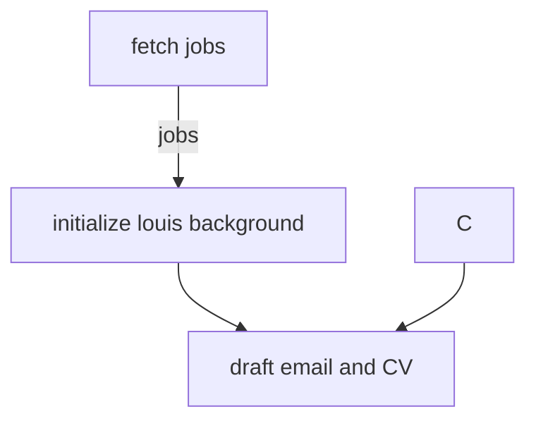
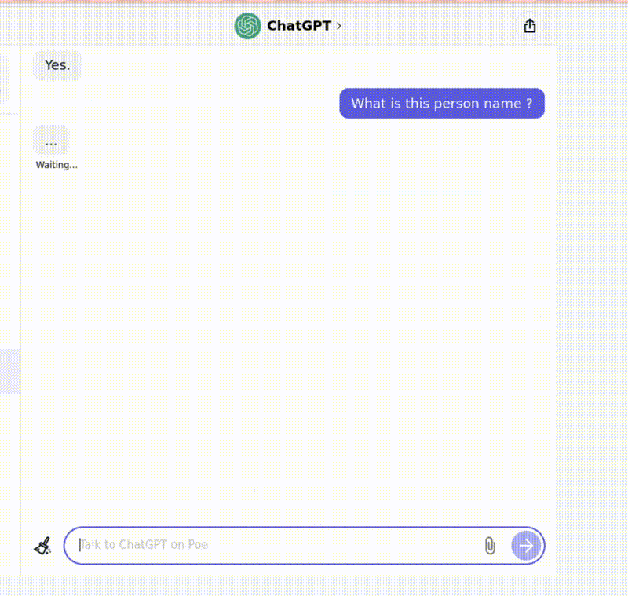

## Flow (planning)




### preprompt tryout

### test 1 (testing on chatGPT)
preprompt
start a fresh talk
remember you a person live in hong kong named louis

question
what is this person name ?



### google-palm tryout


### start

```bash
# build openbox-ubuntu image
$ ./build.sh

$ docker compose up -d
```

### to run script inside src directory

### mapping:
  - ./openbox-firefox/src:/app

```bash
$ cd /app
$ ./test.sh
```


### References:
https://github.com/f/awesome-chatgpt-prompts
https://github.com/leob/express-mongo-rest-starter