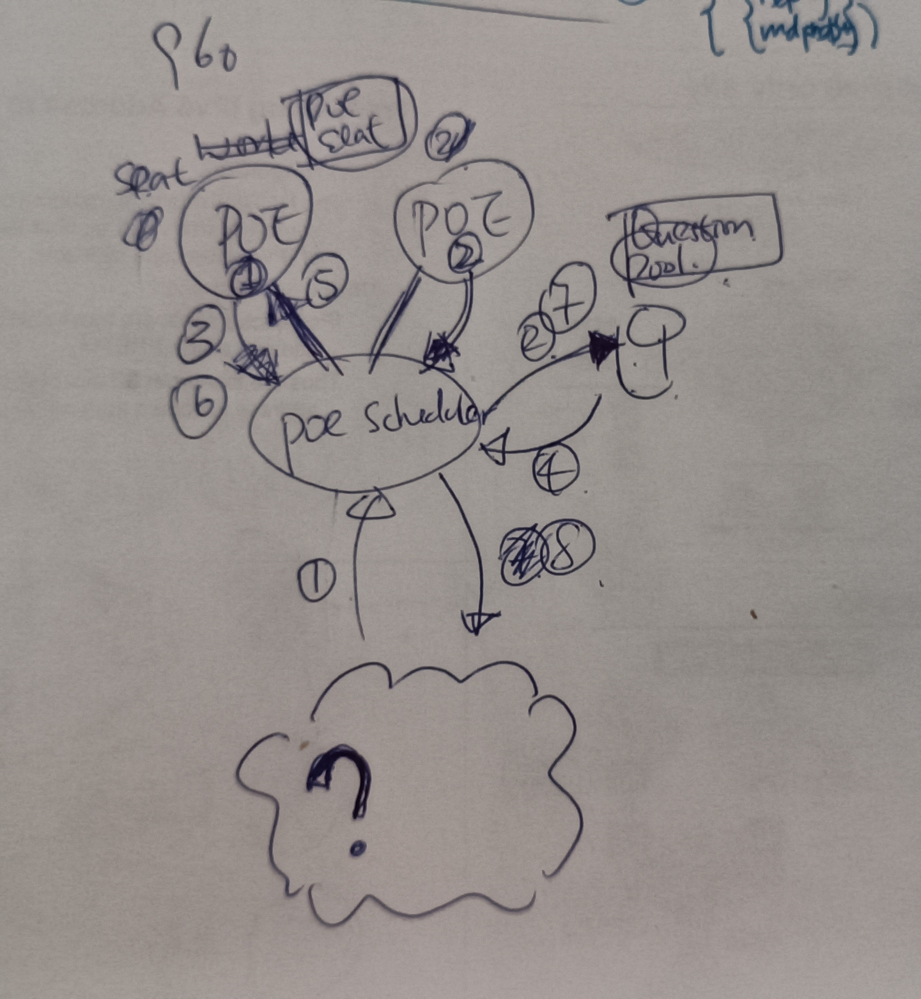

### mechanizm of question pool and poe-seat-pool

1. question from somewhere in json format arrive `poe-scheduler-api` with a `callback address`
1. `poe-scheduler-api` save question into `question-pool-db`
1. `poe-seat` ask `poe-scheduler-api` for question when timeslot available
1. `poe-scheduler-api` fetch question from `question-pool-db`
1. `poe-scheduler-api` answer api call @3. using fetched question.
1. `poe-seat` answer poe-scheduler with answer get from poe web site.
1. `poe-scheduler-api` mark question completed into `question-pool-db`
1. `poe-scheduler-api` call the `callback address` assigned in the question